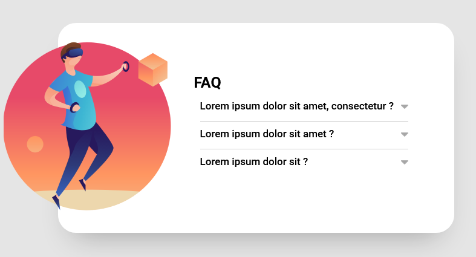

# Pratica-javascript-intermediario

Exercícios e estudos de JavaScritp vanilla para a criação de acordeon e efeito carrossel em sites.

### Carrossel

No carrossel você poderá alternar entre as imagens e os textos sofrerão leves alterações, nele também os botões para avançar e retroceder ficarão desabilitados caso você esteja na primeira ou na última imagem

### Acordeon
Um exemplo simples do efeito acordeon utilizado em sites, nele ao expandir uma aba ocorrerá uma pequena alteração no ícone na lateral do acordeon

## Imagens do projeto

### Carrossel

### Acordeon

